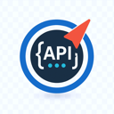

# API Navigator for Spring Boot

<div align="center">
  
  
  [](https://github.com/xkcoding/API-Navigator/actions/workflows/ci.yml)
  [](https://github.com/xkcoding/API-Navigator/actions/workflows/release.yml)
  [](https://marketplace.visualstudio.com/items?itemName=xkcoding.xkcoding-api-navigator)
  [](https://marketplace.visualstudio.com/items?itemName=xkcoding.xkcoding-api-navigator)
  [](https://marketplace.visualstudio.com/items?itemName=xkcoding.xkcoding-api-navigator)
  [](https://opensource.org/licenses/MIT)
</div>

一个强大的 VSCode 扩展，帮助 Java Spring Boot 开发者快速导航和管理 REST API 端点。

## 📖 项目概述

API Navigator 是从 IntelliJ IDEA 插件 RestfulHelper 移植而来的 VSCode 扩展，专为 Spring Boot 项目设计，提供直观的 API 端点管理和导航功能。

## ✨ 主要功能

### 🎯 核心特性

- **🌲 侧边栏树视图**: 按控制器分组显示所有 REST API 端点
- **🔍 快速搜索**: 使用 `CMD+\` 快捷键快速查找 API 端点  
- **🚀 智能跳转**: 点击端点直接跳转到对应的控制器方法
- **⚡ 实时更新**: 文件变更时自动更新 API 索引
- **📊 统计信息**: 显示项目中的 API 统计信息

### 🏗️ 技术架构

- **🔄 Worker Threads**: 多线程并行解析 Java 文件，保证 UI 响应性
- **📈 增量更新**: 智能检测文件变更，只更新修改的部分
- **💾 持久化缓存**: 减少重复解析，提升启动速度  
- **🎨 直观 UI**: 符合 VSCode 设计规范的用户界面

## 🎯 支持的注解

当前版本支持以下 Spring Boot 注解：

### 控制器注解
- `@RestController`
- `@Controller`

### 请求映射注解  
- `@RequestMapping`
- `@GetMapping` 
- `@PostMapping`
- `@PutMapping`
- `@DeleteMapping`
- `@PatchMapping`

### 参数注解
- `@PathVariable`
- `@RequestParam` 
- `@RequestBody`

## 🚀 快速开始

### 安装要求

- VSCode 1.60.0+
- Java 项目 (Spring Boot 推荐)

### 安装插件

#### 方式 1: VSCode 扩展市场
1. 在 VSCode 扩展市场搜索 "API Navigator for Spring Boot"
2. 寻找我们的专用图标： 
3. 点击安装
4. 重新加载 VSCode

#### 方式 2: 命令行安装
```bash
code --install-extension xkcoding.xkcoding-api-navigator
```

#### 方式 3: 手动安装
1. 从 [GitHub Releases](https://github.com/xkcoding/API-Navigator/releases) 下载最新的 `.vsix` 文件
2. 在 VSCode 中使用 `Extensions: Install from VSIX...` 命令安装

### 使用方法

1. **打开 Java Spring Boot 项目**
2. **查看侧边栏**: 在资源管理器中找到 "API Navigator" 面板
3. **快速搜索**: 按 `CMD+\` (Mac) 或 `Ctrl+\` (Windows/Linux) 打开 API 搜索
4. **跳转代码**: 点击任意 API 端点跳转到对应代码

## 📊 性能指标

- ⚡ **启动时间**: < 3秒 (1000个文件以内)
- 🔍 **搜索响应**: < 200ms
- 💾 **内存使用**: < 100MB  
- 📝 **文件更新**: < 500ms 延迟

## 🛠️ 开发状态

### ✅ 已完成功能

#### 核心功能
- [x] **基础架构**: TypeScript + VSCode Extension API
- [x] **Java 解析器**: 基于 java-ast 库的 Spring 注解解析
- [x] **Worker Threads**: 多线程异步处理架构  
- [x] **API 索引器**: 智能索引管理和搜索
- [x] **侧边栏 UI**: 树视图显示和交互
- [x] **快速搜索**: CMD+\ 快捷键搜索功能
- [x] **代码跳转**: 点击端点跳转到源码位置
- [x] **文件监控**: 实时检测 Java 文件变更

#### CI/CD 和质量保证
- [x] **GitHub Actions CI**: Node.js 矩阵测试 (18, 20)
- [x] **自动化测试**: Jest 测试框架，覆盖率 41.7%
- [x] **代码质量**: TypeScript 编译检查，ESLint
- [x] **安全审计**: npm audit 依赖安全检查
- [x] **自动发布**: VSCode Marketplace 自动发布
- [x] **依赖管理**: Dependabot 自动依赖更新
- [x] **应用图标**: 多分辨率专业图标设计 (128px/256px/512px)
- [x] **测试验证**: 在真实 Spring Boot 项目中测试完成
- [x] **性能优化**: 大型项目性能调优完成
  
  <div align="center">
    
    
    
    <br>
    <small>🎨 专业图标设计：指南针 + API 概念，多分辨率适配</small>
  </div>

### 🚧 进行中

- [ ] **错误处理**: 完善异常情况处理
- [ ] **测试覆盖率提升**: 目标从 41.7% 提升到 70%+
- [ ] **用户反馈收集**: 基于 Marketplace 用户反馈持续改进

### 📋 待开发  

- [ ] **高级搜索**: 按 HTTP 方法、路径模式过滤
- [ ] **API 文档**: 集成 Swagger/OpenAPI 文档
- [ ] **测试集成**: API 测试工具集成
- [ ] **多框架支持**: Micronaut、JAX-RS 支持

## 🏗️ 项目架构

### 核心组件

```
src/
├── core/                   # 核心业务逻辑
│   ├── JavaASTParser.ts   # Java AST 解析器
│   ├── ApiIndexer.ts      # API 索引管理器  
│   ├── WorkerPool.ts      # 工作线程池
│   └── types.ts           # 类型定义
├── ui/                     # 用户界面组件
│   ├── ApiNavigatorProvider.ts  # 侧边栏树视图
│   └── SearchProvider.ts       # 快速搜索面板
├── workers/               # 工作线程
│   └── worker.ts         # Worker 脚本
└── extension.ts          # 插件入口
```

### 技术栈

- **语言**: TypeScript  
- **运行时**: Node.js 16+
- **平台**: VSCode Extension API 1.60+
- **构建工具**: TypeScript Compiler
- **Java 解析**: java-ast 库
- **并发处理**: Worker Threads
- **测试框架**: Jest
- **CI/CD**: GitHub Actions

## 🔧 开发环境设置

### 环境要求
- Node.js 16+ 
- npm 7+
- VSCode 1.60.0+
- Git

### 本地开发

1. **克隆仓库**
   ```bash
   git clone --recursive https://github.com/xkcoding/API-Navigator.git
   cd API-Navigator
   ```

2. **安装依赖**
   ```bash
   npm install
   ```

3. **编译项目**
   ```bash
   npm run compile
   ```

4. **运行测试**
   ```bash
   npm test
   npm run test:coverage  # 查看覆盖率报告
   ```

5. **开发调试**
   - 在 VSCode 中按 `F5` 启动调试
   - 选择 "Launch Extension" 配置
   - 新窗口将加载开发中的扩展

### 构建和发布

#### 本地构建
```bash
# 编译 TypeScript
npm run compile

# 构建扩展包
npm run vscode:prepublish

# 打包 VSIX (使用新版工具)
npx @vscode/vsce package
```

> **⚠️ 重要**: 请使用新版 `@vscode/vsce` 工具，旧版 `vsce` 已被弃用。如遇冲突，请使用 `npm install -g @vscode/vsce --force`

#### 自动发布流程
1. **创建 Release**: 在 GitHub 上创建新的 Release
2. **自动触发**: GitHub Actions 自动执行构建和发布
3. **多端发布**: 同时发布到 VSCode Marketplace 和 GitHub Releases

### 质量保证

#### 测试策略
- **单元测试**: Jest 测试核心组件
- **集成测试**: VSCode 扩展环境测试
- **CI 测试**: GitHub Actions 多 Node.js 版本测试

#### 代码质量
- **TypeScript**: 严格类型检查
- **覆盖率**: 当前 41.7%，目标 70%+
- **安全审计**: npm audit + Dependabot

#### 设计资源
- **图标设计**: 查看 [icon-design-spec.md](icon-design-spec.md) 了解设计理念
- **图标文件**: `images/` 目录包含多分辨率版本
- **设计概念**: 指南针象征导航 + API 符号，体现扩展功能

## 🤝 贡献指南

欢迎贡献代码！请查看我们的贡献指南：

1. Fork 项目
2. 创建功能分支: `git checkout -b feature/new-feature`  
3. 提交修改: `git commit -am 'Add new feature'`
4. 推送分支: `git push origin feature/new-feature`
5. 创建 Pull Request

### 开发规范
- 遵循 TypeScript 最佳实践
- 编写单元测试覆盖新功能
- 更新相关文档
- 确保 CI 检查通过

## 📞 支持和反馈

### 问题报告
- [GitHub Issues](https://github.com/xkcoding/API-Navigator/issues): 报告 Bug 或请求新功能
- [VSCode Marketplace](https://marketplace.visualstudio.com/items?itemName=xkcoding.xkcoding-api-navigator): 用户评价和反馈

### 社区资源
- **文档**: [项目 Wiki](https://github.com/xkcoding/API-Navigator/wiki)
- **讨论**: [GitHub Discussions](https://github.com/xkcoding/API-Navigator/discussions)
- **更新日志**: [Releases](https://github.com/xkcoding/API-Navigator/releases)

## 📊 项目统计

| 指标 | 状态 |
|------|------|
| **代码行数** | ~2,000+ 行 TypeScript |
| **测试覆盖率** | 41.7% (持续提升中) |
| **CI/CD 状态** | ✅ 完整自动化 |
| **发布版本** | v1.0.0 (已发布) |
| **支持平台** | Windows, macOS, Linux |
| **Marketplace** | ✅ 已上线 |
| **测试验证** | ✅ 生产环境验证 |

## 📄 许可证

本项目基于 MIT 许可证开源 - 查看 [LICENSE](LICENSE) 文件了解详情。

## 🙏 致谢

- 原 IntelliJ IDEA 插件 [RestfulHelper](RestfulHelper/) 
- VSCode Extension API 文档和社区
- java-ast 库开发者

## 📞 联系我们

- **作者**: xkcoding (Yangkai.Shen)
- **邮箱**: 237497819@qq.com  
- **GitHub**: https://github.com/xkcoding/API-Navigator
- **VSCode Marketplace**: https://marketplace.visualstudio.com/publishers/xkcoding

---

**🌟 如果这个项目对你有帮助，请给我们一个 Star！** 

**📦 立即体验**: [安装 API Navigator for Spring Boot](https://marketplace.visualstudio.com/items?itemName=xkcoding.xkcoding-api-navigator) 