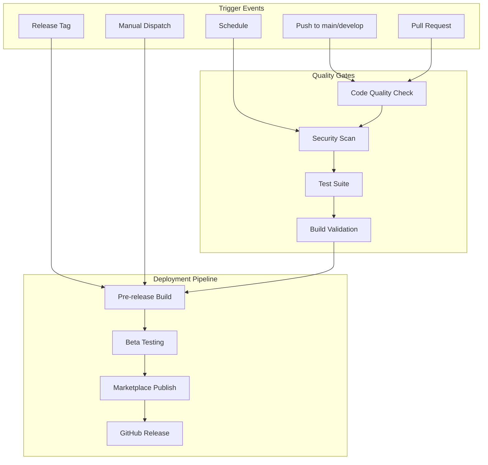

# 创意阶段：GitHub Actions CI/CD 流程设计

## 1️⃣ 问题定义与需求分析

### 核心挑战
为 API Navigator VSCode 插件设计一个完整的 CI/CD 流程，确保代码质量、自动化测试、安全性检查和自动发布到 VSCode Marketplace。

### CI/CD 需求分析
1. **自动化测试**: 单元测试、集成测试、端到端测试
2. **代码质量**: ESLint、Prettier、TypeScript检查、代码覆盖率
3. **安全扫描**: 依赖漏洞检查、代码安全分析
4. **构建打包**: 多环境构建、插件打包(.vsix)
5. **自动发布**: 版本管理、Marketplace发布、GitHub Releases
6. **性能监控**: 插件性能测试、内存泄漏检测
7. **文档生成**: API文档、README更新、CHANGELOG生成

### 触发场景
- **Push**: 代码推送到 main/develop 分支
- **Pull Request**: PR 创建和更新
- **Release**: 版本标签创建
- **Schedule**: 定时安全扫描和依赖更新
- **Manual**: 手动触发特殊流程

---

## 2️⃣ CI/CD 架构设计

### 工作流架构图


### 多环境策略
```yaml
environments:
  development:
    branch: develop
    auto_deploy: false
    tests: basic
  
  staging:
    branch: main
    auto_deploy: true
    tests: comprehensive
  
  production:
    trigger: release_tag
    auto_deploy: true
    tests: full_suite
    marketplace: true
```

---

## 3️⃣ 工作流设计方案

### 方案 A: 分离式工作流
```yaml
# 优点: 职责清晰，易于维护
# 缺点: 工作流较多，管理复杂
workflows:
  - ci.yml           # 持续集成
  - cd.yml           # 持续部署  
  - security.yml     # 安全扫描
  - performance.yml  # 性能测试
  - release.yml      # 发布流程
```

### 方案 B: 统一式工作流
```yaml
# 优点: 集中管理，减少重复
# 缺点: 单个文件过大，调试困难
workflows:
  - main.yml         # 主要CI/CD流程
  - scheduled.yml    # 定时任务
```

### 方案 C: 混合式工作流 (推荐)
```yaml
# 平衡复杂度和可维护性
workflows:
  - ci.yml           # 代码质量 + 测试
  - cd.yml           # 构建 + 部署
  - security.yml     # 安全扫描
  - maintenance.yml  # 定时维护任务
```

---

## 4️⃣ 详细工作流设计

### CI 工作流 (ci.yml)
```yaml
name: Continuous Integration

on:
  push:
    branches: [main, develop]
  pull_request:
    branches: [main]

jobs:
  quality-check:
    name: Code Quality & Testing
    runs-on: ubuntu-latest
    strategy:
      matrix:
        node-version: [16, 18, 20]
    
    steps:
      - name: Checkout code
        uses: actions/checkout@v4
        with:
          submodules: recursive
      
      - name: Setup Node.js
        uses: actions/setup-node@v4
        with:
          node-version: ${{ matrix.node-version }}
          cache: 'npm'
      
      - name: Install dependencies
        run: |
          cd api-navigator
          npm ci
      
      - name: Code style check
        run: |
          cd api-navigator
          npm run lint
          npm run format:check
      
      - name: TypeScript check
        run: |
          cd api-navigator
          npm run type-check
      
      - name: Unit tests
        run: |
          cd api-navigator
          npm run test:unit -- --coverage
      
      - name: Integration tests
        run: |
          cd api-navigator
          npm run test:integration
      
      - name: Upload coverage
        uses: codecov/codecov-action@v3
        with:
          file: ./api-navigator/coverage/lcov.info
          flags: unittests
          name: codecov-umbrella
  
  java-parser-test:
    name: Java Parser Validation
    runs-on: ubuntu-latest
    
    steps:
      - name: Checkout code
        uses: actions/checkout@v4
        with:
          submodules: recursive
      
      - name: Setup Java
        uses: actions/setup-java@v4
        with:
          distribution: 'temurin'
          java-version: '17'
      
      - name: Setup Node.js
        uses: actions/setup-node@v4
        with:
          node-version: '18'
          cache: 'npm'
      
      - name: Install dependencies
        run: |
          cd api-navigator
          npm ci
      
      - name: Test Java Spring Boot parsing
        run: |
          cd api-navigator
          npm run test:java-parser
      
      - name: Test with sample projects
        run: |
          cd api-navigator
          npm run test:samples
```

### CD 工作流 (cd.yml)
```yaml
name: Continuous Deployment

on:
  push:
    branches: [main]
    tags: ['v*']
  workflow_dispatch:
    inputs:
      environment:
        description: 'Target environment'
        required: true
        default: 'staging'
        type: choice
        options:
          - staging
          - production

jobs:
  build:
    name: Build Extension
    runs-on: ubuntu-latest
    outputs:
      version: ${{ steps.version.outputs.version }}
      
    steps:
      - name: Checkout code
        uses: actions/checkout@v4
        with:
          submodules: recursive
      
      - name: Setup Node.js
        uses: actions/setup-node@v4
        with:
          node-version: '18'
          cache: 'npm'
      
      - name: Install dependencies
        run: |
          cd api-navigator
          npm ci
      
      - name: Get version
        id: version
        run: |
          cd api-navigator
          echo "version=$(node -p "require('./package.json').version")" >> $GITHUB_OUTPUT
      
      - name: Build extension
        run: |
          cd api-navigator
          npm run build
      
      - name: Package extension
        run: |
          cd api-navigator
          npx vsce package --out ../api-navigator-${{ steps.version.outputs.version }}.vsix
      
      - name: Upload artifact
        uses: actions/upload-artifact@v4
        with:
          name: api-navigator-${{ steps.version.outputs.version }}
          path: api-navigator-${{ steps.version.outputs.version }}.vsix
  
  deploy-staging:
    name: Deploy to Staging
    needs: build
    if: github.ref == 'refs/heads/main'
    runs-on: ubuntu-latest
    environment: staging
    
    steps:
      - name: Download artifact
        uses: actions/download-artifact@v4
        with:
          name: api-navigator-${{ needs.build.outputs.version }}
      
      - name: Install in test environment
        run: |
          # 在测试环境中安装插件进行验证
          echo "Installing extension for testing..."
  
  deploy-production:
    name: Deploy to Production
    needs: build
    if: startsWith(github.ref, 'refs/tags/v')
    runs-on: ubuntu-latest
    environment: production
    
    steps:
      - name: Download artifact
        uses: actions/download-artifact@v4
        with:
          name: api-navigator-${{ needs.build.outputs.version }}
      
      - name: Publish to Marketplace
        env:
          VSCE_PAT: ${{ secrets.VSCE_PAT }}
        run: |
          npx vsce publish --packagePath api-navigator-${{ needs.build.outputs.version }}.vsix
      
      - name: Create GitHub Release
        uses: softprops/action-gh-release@v1
        with:
          files: api-navigator-${{ needs.build.outputs.version }}.vsix
          generate_release_notes: true
          draft: false
          prerelease: false
```

### 安全扫描工作流 (security.yml)
```yaml
name: Security Scan

on:
  push:
    branches: [main]
  pull_request:
    branches: [main]
  schedule:
    - cron: '0 2 * * 1' # 每周一凌晨2点

jobs:
  dependency-scan:
    name: Dependency Vulnerability Scan
    runs-on: ubuntu-latest
    
    steps:
      - name: Checkout code
        uses: actions/checkout@v4
        with:
          submodules: recursive
      
      - name: Run npm audit
        run: |
          cd api-navigator
          npm audit --audit-level=high
      
      - name: Snyk security scan
        uses: snyk/actions/node@master
        env:
          SNYK_TOKEN: ${{ secrets.SNYK_TOKEN }}
        with:
          args: --severity-threshold=high
          command: test
  
  code-security:
    name: Code Security Analysis
    runs-on: ubuntu-latest
    
    steps:
      - name: Checkout code
        uses: actions/checkout@v4
        with:
          submodules: recursive
      
      - name: Initialize CodeQL
        uses: github/codeql-action/init@v3
        with:
          languages: javascript
      
      - name: Autobuild
        uses: github/codeql-action/autobuild@v3
      
      - name: Perform CodeQL Analysis
        uses: github/codeql-action/analyze@v3

  secret-scan:
    name: Secret Detection
    runs-on: ubuntu-latest
    
    steps:
      - name: Checkout code
        uses: actions/checkout@v4
        with:
          fetch-depth: 0
      
      - name: TruffleHog OSS
        uses: trufflesecurity/trufflehog@main
        with:
          path: ./
          base: main
          head: HEAD
          extra_args: --debug --only-verified
```

### 维护任务工作流 (maintenance.yml)
```yaml
name: Maintenance Tasks

on:
  schedule:
    - cron: '0 1 * * 1'  # 每周一凌晨1点
  workflow_dispatch:

jobs:
  update-dependencies:
    name: Update Dependencies
    runs-on: ubuntu-latest
    
    steps:
      - name: Checkout code
        uses: actions/checkout@v4
        with:
          token: ${{ secrets.GITHUB_TOKEN }}
          submodules: recursive
      
      - name: Setup Node.js
        uses: actions/setup-node@v4
        with:
          node-version: '18'
      
      - name: Update npm dependencies
        run: |
          cd api-navigator
          npx npm-check-updates -u
          npm install
      
      - name: Update submodules
        run: |
          git submodule update --remote RestfulHelper
      
      - name: Run tests
        run: |
          cd api-navigator
          npm test
      
      - name: Create Pull Request
        uses: peter-evans/create-pull-request@v5
        with:
          token: ${{ secrets.GITHUB_TOKEN }}
          commit-message: "🔄 自动更新依赖包和子模块"
          title: "🔄 Weekly Dependencies Update"
          body: |
            ## 自动依赖更新
            
            本PR由GitHub Actions自动创建，包含以下更新：
            
            ### 📦 npm 依赖更新
            - 自动更新所有可更新的依赖包
            
            ### 🔄 RestfulHelper 子模块更新  
            - 同步最新的上游更改
            
            ### ✅ 测试结果
            - 所有测试已通过
            
            请review后合并。
          branch: auto-update-dependencies
          delete-branch: true

  performance-monitoring:
    name: Performance Monitoring
    runs-on: ubuntu-latest
    
    steps:
      - name: Checkout code
        uses: actions/checkout@v4
        with:
          submodules: recursive
      
      - name: Setup Node.js
        uses: actions/setup-node@v4
        with:
          node-version: '18'
      
      - name: Install dependencies
        run: |
          cd api-navigator
          npm ci
      
      - name: Performance benchmark
        run: |
          cd api-navigator
          npm run test:performance
      
      - name: Memory leak test
        run: |
          cd api-navigator
          npm run test:memory
      
      - name: Upload performance report
        uses: actions/upload-artifact@v4
        with:
          name: performance-report-${{ github.run_number }}
          path: api-navigator/performance-report.html
```

### 测试样本文件策略

#### 问题识别 ⚠️
原设计中的 `--testPathPattern=RestfulHelper` 存在问题：RestfulHelper 是 IDEA 插件源码仓库，主要包含 Kotlin 代码，**不包含实际的 Spring Boot 控制器示例**。

#### 解决方案: 创建专门的测试样本 ✅

##### 1. 测试样本文件结构
```
api-navigator/
├── test/
│   ├── fixtures/                    # 测试样本文件
│   │   ├── java-samples/           # Java Spring Boot 示例
│   │   │   ├── BasicController.java
│   │   │   ├── ComplexController.java
│   │   │   ├── MultiAnnotationController.java
│   │   │   └── EdgeCaseController.java
│   │   └── expected-results/       # 预期解析结果
│   │       ├── BasicController.json
│   │       └── ...
│   └── java-parser/                # Java 解析器测试
│       ├── parser.test.ts
│       ├── annotation.test.ts
│       └── integration.test.ts
```

##### 2. 示例测试样本文件

**BasicController.java** - 基础测试用例：
```java
package com.example.demo.controller;

import org.springframework.web.bind.annotation.*;

@RestController
@RequestMapping("/api/users")
public class BasicController {
    
    @GetMapping("/{id}")
    public User getUser(@PathVariable Long id) {
        return new User();
    }
    
    @PostMapping("/register")
    public User createUser(@RequestBody User user) {
        return user;
    }
}
```

**ComplexController.java** - 复杂注解组合：
```java
@RestController
@RequestMapping("/api/v1/complex")
public class ComplexController {
    
    @RequestMapping(value = "/legacy", method = RequestMethod.GET)
    public String legacyEndpoint() { return "legacy"; }
    
    @GetMapping(value = {"/multi1", "/multi2"})
    public String multipleUris() { return "multi"; }
    
    @PostMapping(value = "/params", params = "type=admin")
    public String withParams() { return "params"; }
}
```

**EdgeCaseController.java** - 边界情况测试：
```java
@Controller  // 注意：不是 @RestController
public class EdgeCaseController {
    
    @GetMapping("/no-class-mapping")
    public String noClassMapping() { return "view"; }
    
    // 没有任何映射注解的方法
    public void nonMappedMethod() {}
}
```

##### 3. 测试脚本更新

**package.json 测试脚本**：
```json
{
  "scripts": {
    "test:java-parser": "jest test/java-parser --testTimeout=30000",
    "test:samples": "jest test/integration/samples.test.ts",
    "test:fixtures": "npm run test:java-parser && npm run test:samples"
  }
}
```

**samples.test.ts** - 样本文件集成测试：
```typescript
import { JavaSpringParser } from '../src/core/parser/JavaSpringParser';
import fs from 'fs';
import path from 'path';

describe('Java Spring Boot Samples', () => {
  const parser = new JavaSpringParser();
  const fixturesDir = path.join(__dirname, '../fixtures/java-samples');
  
  test('should parse BasicController correctly', async () => {
    const javaCode = fs.readFileSync(
      path.join(fixturesDir, 'BasicController.java'), 
      'utf-8'
    );
    
    const endpoints = await parser.parseController(javaCode);
    
    expect(endpoints).toHaveLength(2);
    expect(endpoints[0]).toMatchObject({
      method: 'GET',
      path: '/api/users/{id}',
      controllerClass: 'BasicController',
      methodName: 'getUser'
    });
    expect(endpoints[1]).toMatchObject({
      method: 'POST', 
      path: '/api/users/register',
      controllerClass: 'BasicController',
      methodName: 'createUser'
    });
  });
  
  test('should handle complex annotations', async () => {
    const javaCode = fs.readFileSync(
      path.join(fixturesDir, 'ComplexController.java'),
      'utf-8'
    );
    
    const endpoints = await parser.parseController(javaCode);
    
    // 验证复杂注解解析
    const legacyEndpoint = endpoints.find(e => e.methodName === 'legacyEndpoint');
    expect(legacyEndpoint).toMatchObject({
      method: 'GET',
      path: '/api/v1/complex/legacy'
    });
    
    // 验证多路径解析
    const multiEndpoints = endpoints.filter(e => e.methodName === 'multipleUris');
    expect(multiEndpoints).toHaveLength(2);
    expect(multiEndpoints.map(e => e.path)).toEqual([
      '/api/v1/complex/multi1',
      '/api/v1/complex/multi2'
    ]);
  });
  
  test('should handle edge cases gracefully', async () => {
    const javaCode = fs.readFileSync(
      path.join(fixturesDir, 'EdgeCaseController.java'),
      'utf-8'
    );
    
    const endpoints = await parser.parseController(javaCode);
    
    // 应该只解析有映射注解的方法
    expect(endpoints).toHaveLength(1);
    expect(endpoints[0]).toMatchObject({
      method: 'GET',
      path: '/no-class-mapping',
      controllerClass: 'EdgeCaseController'
    });
  });
});
```

##### 4. CI/CD 集成优化

**更新后的测试策略**：
```yaml
- name: Test Java Spring Boot parsing
  run: |
    cd api-navigator
    npm run test:java-parser
    
- name: Test with sample projects  
  run: |
    cd api-navigator
    npm run test:samples
    
- name: Generate coverage report
  run: |
    cd api-navigator
    npm run test:coverage -- --testPathPattern="test/(java-parser|integration)"
```

##### 5. 持续改进机制

**动态样本更新**：
- 定期添加新的测试样本覆盖更多场景
- 当发现解析问题时，将错误案例转化为测试样本
- 支持从真实的开源项目中提取典型控制器作为样本

**覆盖率目标**：
- Spring Boot 基础注解：100%
- 注解组合场景：90%
- 边界情况处理：85%
- 错误处理：80%

---

## 5️⃣ 高级特性设计

### 智能版本管理
```yaml
# 基于 Conventional Commits 自动版本控制
version_strategy:
  major: "BREAKING CHANGE"
  minor: "feat"
  patch: "fix|perf"
  
  auto_release:
    enabled: true
    branches: [main]
    changelog: true
```

### 并行测试矩阵
```yaml
strategy:
  matrix:
    os: [ubuntu-latest, windows-latest, macos-latest]
    node: [16, 18, 20]
    vscode: ['1.60.0', '1.70.0', 'latest']
  fail-fast: false
```

### 缓存优化策略
```yaml
cache_strategy:
  npm_cache:
    key: ${{ runner.os }}-node-${{ hashFiles('**/package-lock.json') }}
    restore-keys: ${{ runner.os }}-node-
  
  build_cache:
    key: ${{ runner.os }}-build-${{ github.sha }}
    restore-keys: ${{ runner.os }}-build-
```

### 通知机制
```yaml
notifications:
  slack:
    webhook: ${{ secrets.SLACK_WEBHOOK }}
    conditions:
      - build_failure
      - security_alert
      - release_success
  
  email:
    recipients: ${{ secrets.MAINTAINER_EMAILS }}
    conditions:
      - critical_security_issue
```

---

## 6️⃣ 环境变量和密钥管理

### GitHub Secrets 配置
```yaml
required_secrets:
  VSCE_PAT: "VSCode Marketplace Personal Access Token"
  SNYK_TOKEN: "Snyk安全扫描Token"
  CODECOV_TOKEN: "代码覆盖率上传Token"
  SLACK_WEBHOOK: "Slack通知Webhook"
  MAINTAINER_EMAILS: "维护者邮箱列表"

environment_variables:
  NODE_ENV: production
  EXTENSION_ID: "xkcoding.api-navigator"
  MARKETPLACE_PUBLISHER: "xkcoding"
```

### 权限配置
```yaml
permissions:
  contents: read
  security-events: write
  pull-requests: write
  packages: write
  actions: read
  checks: write
```

---

## 7️⃣ 质量门禁设计

### 代码质量门禁
```yaml
quality_gates:
  code_coverage:
    minimum: 80%
    fail_on_decrease: true
  
  linting:
    max_warnings: 10
    max_errors: 0
  
  security:
    allow_high_vulnerabilities: 0
    allow_medium_vulnerabilities: 5
  
  performance:
    max_startup_time: 3000ms
    max_memory_usage: 100MB
```

### 发布条件
```yaml
release_conditions:
  required_checks:
    - "quality-check"
    - "java-parser-test"
    - "security-scan"
    - "performance-test"
  
  required_approvals: 1
  require_signed_commits: true
  restrict_pushes: true
```

---

## 8️⃣ 监控和分析

### 使用情况分析
```yaml
analytics:
  marketplace_metrics:
    - download_count
    - user_ratings
    - installation_success_rate
  
  performance_metrics:
    - startup_time
    - memory_usage
    - api_response_time
  
  error_tracking:
    - crash_reports
    - error_frequency
    - user_feedback
```

### 健康检查
```yaml
health_checks:
  marketplace_availability:
    schedule: "*/30 * * * *"
    timeout: 30s
  
  extension_functionality:
    schedule: "0 */6 * * *"
    test_suites: ["basic", "integration"]
```

---

## 9️⃣ 实施优先级

### Phase 1: 基础 CI/CD (高优先级)
- ✅ 基本的CI工作流 (代码质量 + 测试)
- ✅ CD工作流 (构建 + 打包)
- ✅ 简单的发布流程

### Phase 2: 安全和质量 (中优先级)  
- ✅ 安全扫描工作流
- ✅ 代码覆盖率和质量门禁
- ✅ 自动化测试矩阵

### Phase 3: 高级特性 (低优先级)
- ✅ 性能监控和基准测试
- ✅ 智能依赖更新
- ✅ 通知和分析系统

---

## 🎯 成功指标

### 技术指标
- **构建成功率**: > 95%
- **测试覆盖率**: > 80%
- **安全漏洞**: 0个高危漏洞
- **部署频率**: 每周至少1次

### 效率指标
- **CI/CD 执行时间**: < 15分钟
- **发布周期**: < 1小时
- **回滚时间**: < 5分钟
- **开发者满意度**: > 90%

### 质量指标
- **用户评分**: > 4.0星
- **错误率**: < 1%
- **性能达标**: 100%符合性能目标
- **安全合规**: 通过所有安全检查

---

## 🚀 下一步行动

### Phase 1: 基础设施搭建
1. **创建 api-navigator 项目结构**: VSCode 插件基础框架
2. **设置测试样本文件**: 创建 Java Spring Boot 控制器示例
3. **配置基础 CI 工作流**: 代码质量检查和测试

### Phase 2: CI/CD 流程实施  
1. **创建工作流文件**: 
   - `.github/workflows/ci.yml` - 持续集成
   - `.github/workflows/cd.yml` - 持续部署
   - `.github/workflows/security.yml` - 安全扫描
2. **配置 GitHub Secrets**: VSCE_PAT, SNYK_TOKEN 等必要密钥
3. **测试验证**: 提交代码触发工作流，验证各环节

### Phase 3: 高级特性
1. **性能监控**: 添加基准测试和性能报告
2. **自动维护**: 配置依赖更新和子模块同步
3. **监控优化**: 根据实际使用情况持续优化

### 修正说明 ⚠️

**原问题**: 初始设计中 `--testPathPattern=RestfulHelper` 不合适，因为 RestfulHelper 是插件源码，不包含 Spring Boot 控制器示例。

**解决方案**: 
- ✅ 创建专门的测试样本文件 (`test/fixtures/java-samples/`)
- ✅ 设计完整的测试用例覆盖基础、复杂和边界情况
- ✅ 建立持续改进的测试样本管理机制

**准备进入 GitHub Actions 实施阶段！** 🔧⚡ 