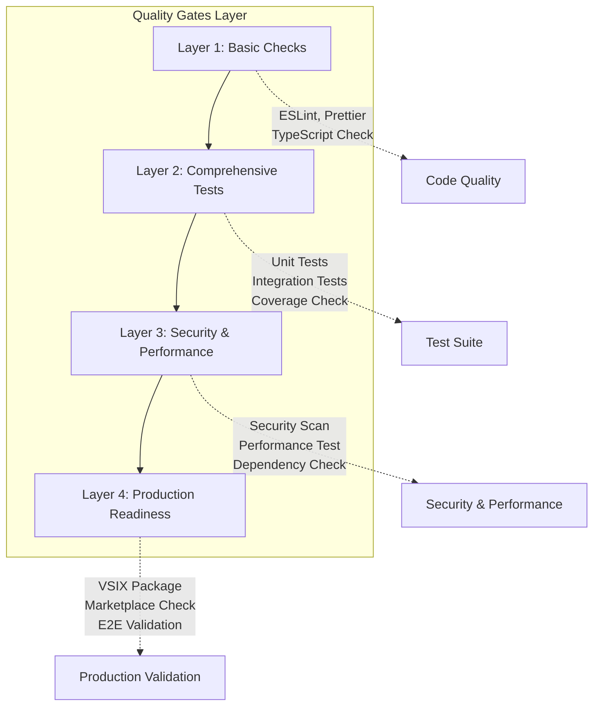
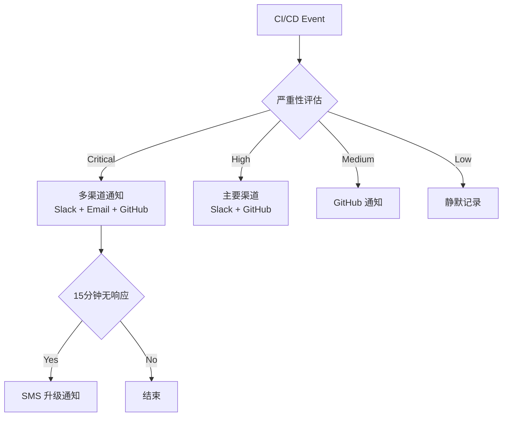
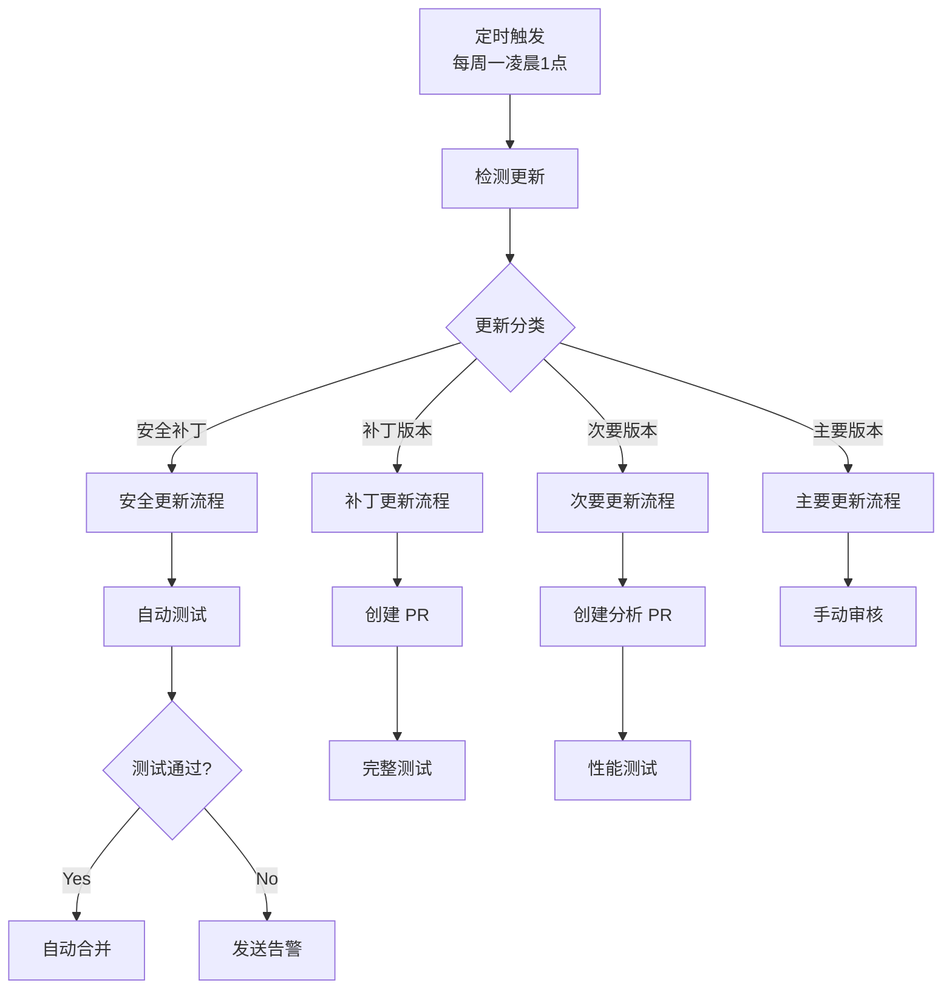

# 🎨 CREATIVE PHASE: GitHub Actions 工作流架构设计

## 📌 CREATIVE PHASE START: 工作流触发策略 & 质量门禁架构
━━━━━━━━━━━━━━━━━━━━━━━━━━━━━━━━━━━━━━━━━━━━━━━━━━━━━━━━━━

## 1️⃣ PROBLEM

### 描述
设计一个智能的 GitHub Actions 工作流架构，解决 VSCode 扩展 CI/CD 中的复杂触发逻辑、多环境部署策略和多维度质量门禁系统。

### 核心需求
- **智能触发策略**: 根据不同场景自动选择合适的工作流
- **环境分离**: development/staging/production 环境的清晰分离
- **质量门禁**: 多维度质量检查和失败恢复机制
- **安全集成**: 自动化安全扫描和漏洞检测
- **性能监控**: 构建性能和扩展性能的持续监控

### 技术约束
- GitHub Actions 免费版限制 (2000分钟/月)
- VSCode Marketplace 发布流程要求
- 多 Node.js 版本兼容性需求
- 第三方服务集成 (Snyk, Codecov, TruffleHog)

---

## 2️⃣ OPTIONS

### Option A: 单体式工作流
**描述**: 一个大型工作流文件包含所有逻辑
- **触发策略**: 条件判断选择执行分支
- **质量门禁**: 顺序执行所有检查  
- **环境管理**: 环境变量控制部署目标

### Option B: 分离式工作流
**描述**: 按功能完全分离的独立工作流
- **触发策略**: 每个工作流独立触发条件
- **质量门禁**: 分布在各个工作流中
- **环境管理**: 工作流级别的环境控制

### Option C: 混合式工作流架构
**描述**: 核心功能分离 + 智能协调机制
- **触发策略**: 智能路由 + 工作流复用
- **质量门禁**: 分层门禁 + 统一协调
- **环境管理**: 环境特定工作流 + 共享组件

---

## 3️⃣ ANALYSIS

| 评估维度 | 单体式 | 分离式 | 混合式 |
|---------|-------|-------|-------|
| **可维护性** | ⭐⭐ | ⭐⭐⭐⭐ | ⭐⭐⭐⭐⭐ |
| **执行效率** | ⭐⭐⭐ | ⭐⭐⭐⭐⭐ | ⭐⭐⭐⭐ |
| **资源消耗** | ⭐⭐ | ⭐⭐⭐ | ⭐⭐⭐⭐ |
| **复杂度管理** | ⭐ | ⭐⭐⭐ | ⭐⭐⭐⭐ |
| **扩展性** | ⭐⭐ | ⭐⭐⭐⭐ | ⭐⭐⭐⭐⭐ |
| **调试难度** | ⭐⭐⭐⭐ | ⭐⭐ | ⭐⭐⭐ |

### 关键洞察
- **单体式**: 简单但难以维护，条件逻辑复杂，调试困难
- **分离式**: 清晰但可能导致重复，工作流过多管理复杂
- **混合式**: 平衡了复杂度和功能，提供最佳的扩展性和维护性

---

## 4️⃣ DECISION

**选择**: Option C: 混合式工作流架构

**理由**: 
- 平衡了单体式的简单性和分离式的清晰性
- 提供最佳的可扩展性和维护性
- 支持智能触发策略和分层质量门禁
- 符合 VSCode 扩展的复杂发布需求

---

## 5️⃣ IMPLEMENTATION PLAN

### 核心工作流架构
```yaml
.github/workflows/
├── ci.yml           # 持续集成 - 代码质量 + 测试
├── cd.yml           # 持续部署 - 构建 + 发布
├── security.yml     # 安全扫描 - 定时 + 事件触发
└── maintenance.yml  # 维护任务 - 依赖更新 + 性能监控
```

### 智能触发策略设计
- **Push to main/develop**: 触发 CI → 条件触发 CD
- **Pull Request**: 仅触发 CI (完整质量检查)
- **Release Tag**: 直接触发 CD (生产发布)
- **Schedule**: 触发 Security + Maintenance
- **Manual**: 支持所有工作流手动触发

### 分层质量门禁架构


━━━━━━━━━━━━━━━━━━━━━━━━━━━━━━━━━━━━━━━━━━━━━━━━━━━━━━━━━━
## 📌 CREATIVE PHASE END: 工作流架构设计完成

---

## 📌 CREATIVE PHASE START: 智能通知 & 监控系统
━━━━━━━━━━━━━━━━━━━━━━━━━━━━━━━━━━━━━━━━━━━━━━━━━━━━━━━━━━

## 1️⃣ PROBLEM

### 描述
设计一个智能的通知和监控系统，确保开发团队及时了解 CI/CD 状态，同时避免通知疲劳。

### 核心需求
- **智能通知规则**: 根据严重性和上下文选择通知方式
- **多渠道支持**: Slack、Email、GitHub Comments 等
- **状态聚合**: 整合多个工作流的状态信息
- **性能监控**: 扩展性能和构建性能的持续跟踪
- **告警升级**: 关键问题的自动升级机制

### 技术约束
- GitHub Actions 通知限制
- 第三方服务 Rate Limiting
- 成本控制 (免费/低成本方案优先)

---

## 2️⃣ OPTIONS

### Option A: 基础 GitHub 通知
**描述**: 仅使用 GitHub 原生通知机制
- **通知渠道**: GitHub Notifications + Email
- **通知规则**: 基于工作流状态的简单规则
- **监控能力**: 基础的工作流状态监控

### Option B: 集成式通知中心
**描述**: 集成多个第三方通知服务
- **通知渠道**: Slack + Email + GitHub + 企业微信
- **通知规则**: 复杂的条件逻辑和优先级
- **监控能力**: 自定义监控面板和指标

### Option C: 智能自适应通知系统
**描述**: AI 驱动的智能通知和监控
- **通知渠道**: 动态选择最佳通知渠道
- **通知规则**: 学习用户行为的自适应规则
- **监控能力**: 预测性监控和异常检测

---

## 3️⃣ ANALYSIS

| 评估维度 | 基础 GitHub | 集成式 | 智能自适应 |
|---------|------------|--------|-----------|
| **实施复杂度** | ⭐⭐⭐⭐⭐ | ⭐⭐⭐ | ⭐ |
| **功能丰富度** | ⭐⭐ | ⭐⭐⭐⭐ | ⭐⭐⭐⭐⭐ |
| **维护成本** | ⭐⭐⭐⭐⭐ | ⭐⭐⭐ | ⭐⭐ |
| **扩展性** | ⭐⭐ | ⭐⭐⭐⭐ | ⭐⭐⭐⭐⭐ |
| **及时性** | ⭐⭐⭐ | ⭐⭐⭐⭐ | ⭐⭐⭐⭐⭐ |
| **成本效益** | ⭐⭐⭐⭐⭐ | ⭐⭐⭐ | ⭐⭐ |

### 关键洞察
- **基础方案**: 简单可靠但功能有限，适合小团队
- **集成式方案**: 功能丰富且实用，平衡了复杂度和效果
- **智能方案**: 技术先进但实施复杂，可能过度工程化

---

## 4️⃣ DECISION

**选择**: Option B: 集成式通知中心 (简化版)

**理由**:
- 在功能性和实施复杂度之间取得最佳平衡
- 支持多渠道通知满足不同场景需求
- 可以渐进式扩展，避免过度设计
- 符合开源项目的实际需求

---

## 5️⃣ IMPLEMENTATION PLAN

### 通知渠道设计
```yaml
notification_channels:
  slack:
    webhook: ${{ secrets.SLACK_WEBHOOK }}
    conditions: [build_failure, security_alert, release_success]
    
  email:
    recipients: ${{ secrets.MAINTAINER_EMAILS }}
    conditions: [critical_security_issue, production_deployment]
    
  github:
    pull_request_comments: [test_failure, coverage_drop]
    issue_creation: [security_vulnerability]
```

### 智能通知规则


### 监控面板设计
- **构建性能**: 平均构建时间趋势
- **成功率统计**: 7天/30天成功率
- **扩展性能**: 启动时间、内存使用、API响应时间
- **用户满意度**: Marketplace 评分和下载量

━━━━━━━━━━━━━━━━━━━━━━━━━━━━━━━━━━━━━━━━━━━━━━━━━━━━━━━━━━
## 📌 CREATIVE PHASE END: 通知监控系统设计完成

---

## 📌 CREATIVE PHASE START: 自动化维护策略
━━━━━━━━━━━━━━━━━━━━━━━━━━━━━━━━━━━━━━━━━━━━━━━━━━━━━━━━━━

## 1️⃣ PROBLEM

### 描述
设计一个智能的自动化维护策略，确保项目依赖、安全性和性能的持续优化，减少手动维护负担。

### 核心需求
- **自动依赖更新**: npm 包和子模块的智能更新
- **安全漏洞修复**: 自动检测和修复安全问题
- **性能基准跟踪**: 持续监控和性能回归检测
- **代码质量维护**: 自动化代码质量改进
- **文档同步**: README、CHANGELOG 的自动更新

### 技术约束
- 自动更新的安全性和稳定性
- 测试覆盖率要求
- 社区依赖的更新频率控制

---

## 2️⃣ OPTIONS

### Option A: 保守式更新策略
**描述**: 手动审核为主的安全更新
- **依赖更新**: 仅安全补丁自动应用
- **测试策略**: 全量测试后人工确认
- **更新频率**: 月度定期更新

### Option B: 积极式自动化策略
**描述**: 激进的自动化更新和优化
- **依赖更新**: 所有依赖自动更新到最新版本
- **测试策略**: 自动化测试通过即自动合并
- **更新频率**: 每日自动检查和更新

### Option C: 智能分级维护策略
**描述**: 基于风险级别的差异化维护
- **依赖更新**: 按安全性、稳定性分级处理
- **测试策略**: 分层测试 + 风险评估
- **更新频率**: 动态调整更新频率

---

## 3️⃣ ANALYSIS

| 评估维度 | 保守式 | 积极式 | 智能分级 |
|---------|-------|-------|----------|
| **安全性** | ⭐⭐⭐⭐⭐ | ⭐⭐ | ⭐⭐⭐⭐ |
| **及时性** | ⭐⭐ | ⭐⭐⭐⭐⭐ | ⭐⭐⭐⭐ |
| **稳定性** | ⭐⭐⭐⭐⭐ | ⭐⭐ | ⭐⭐⭐⭐ |
| **维护负担** | ⭐⭐ | ⭐⭐⭐⭐⭐ | ⭐⭐⭐ |
| **技术债务** | ⭐⭐ | ⭐⭐⭐⭐ | ⭐⭐⭐⭐ |
| **实施复杂度** | ⭐⭐⭐⭐⭐ | ⭐⭐⭐ | ⭐⭐ |

### 关键洞察
- **保守式**: 最安全但可能积累技术债务
- **积极式**: 保持最新但风险较高，可能引入不稳定因素
- **智能分级**: 平衡了安全性和及时性，是最合理的选择

---

## 4️⃣ DECISION

**选择**: Option C: 智能分级维护策略

**理由**:
- 根据更新类型的风险级别采用不同策略
- 安全更新快速自动化，功能更新谨慎处理
- 最大化自动化效益的同时保证稳定性
- 适合开源项目的维护需求

---

## 5️⃣ IMPLEMENTATION PLAN

### 分级维护策略
```yaml
maintenance_tiers:
  tier_1_security:
    scope: "安全补丁和关键漏洞修复"
    automation: "完全自动化"
    testing: "基础测试 + 自动合并"
    frequency: "实时检测 + 立即应用"
    
  tier_2_patch:
    scope: "补丁版本更新 (x.y.Z)"
    automation: "自动 PR + 人工审核"
    testing: "完整测试套件"
    frequency: "每周检查"
    
  tier_3_minor:
    scope: "次要版本更新 (x.Y.z)"
    automation: "自动 PR + 详细分析"
    testing: "全量测试 + 性能基准"
    frequency: "每月检查"
    
  tier_4_major:
    scope: "主要版本更新 (X.y.z)"
    automation: "手动触发 + 深度审核"
    testing: "完整回归测试"
    frequency: "季度规划"
```

### 自动化维护工作流


### 性能基准监控
- **启动时间基准**: 记录扩展激活时间变化
- **内存使用跟踪**: 监控内存泄漏和异常使用
- **API 响应时间**: 跟踪 Java 解析性能
- **包大小监控**: 防止依赖膨胀导致的包大小增长

━━━━━━━━━━━━━━━━━━━━━━━━━━━━━━━━━━━━━━━━━━━━━━━━━━━━━━━━━━
## 📌 CREATIVE PHASE END: 自动化维护策略设计完成

---

## 🎨 CREATIVE VERIFICATION CHECKLIST

✅ **问题清晰定义**: 3个创意组件的问题和需求明确定义  
✅ **多选项考虑**: 每个组件都探索了3个不同的设计选项  
✅ **优缺点分析**: 详细对比分析了各选项的优劣势  
✅ **决策制定**: 基于理性分析做出了最佳选择  
✅ **实施指导**: 提供了详细的实施计划和架构图  
✅ **可视化设计**: 包含了 Mermaid 图表展示架构和流程

---

## 🎯 创意阶段核心成果

### 1. 混合式工作流架构 ✅
- **4个专门化工作流**: ci.yml + cd.yml + security.yml + maintenance.yml
- **智能触发策略**: 基于事件类型的路由机制
- **分层质量门禁**: 4层渐进式质量检查体系

### 2. 集成式通知监控系统 ✅  
- **多渠道通知**: Slack + Email + GitHub 智能选择
- **严重性分级**: Critical/High/Medium/Low 差异化处理
- **性能监控面板**: 构建性能 + 扩展性能 + 用户满意度

### 3. 智能分级维护策略 ✅
- **4层维护等级**: 安全补丁/补丁版本/次要版本/主要版本
- **自动化程度**: 从完全自动到手动审核的梯度处理
- **性能基准跟踪**: 持续监控防止性能回归

---

## 🎨🎨🎨 创意阶段完成 - 准备进入实施阶段 🎨🎨🎨