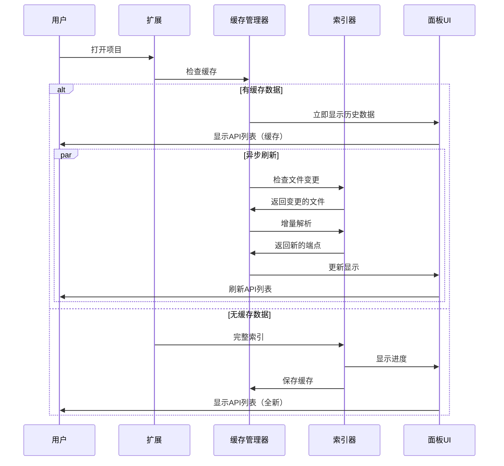

# 创意阶段：持久化索引缓存设计

**项目**: API Navigator - 持久化索引缓存增强  
**复杂度**: Level 2-3 - 架构增强  
**创意时间**: 2025-07-25  
**状态**: 🎨 创意设计中

## 🎯 问题定义

### 当前痛点
- **白屏问题**: 每次打开项目都需要重新索引所有 Java 文件
- **重复解析**: 已经索引过的项目，重新打开时仍需完整扫描  
- **用户体验差**: 大型项目启动时间长，用户需要等待空白面板

### 用户期望
- **立即显示**: 基于历史索引数据，立即显示上次的 API 结构
- **异步刷新**: 后台异步检查文件变更，增量更新索引
- **智能缓存**: 只有文件发生变更时才重新解析

## 🔍 技术调研

### 当前架构分析

```typescript
// 当前数据结构（内存中）
class ApiIndexer {
    private endpoints: Map<string, ApiEndpoint> = new Map();
    private pathIndex: Map<string, Set<string>> = new Map();
    private classIndex: Map<string, Set<string>> = new Map();
}

// 数据类型
interface ApiEndpoint {
    id: string;
    method: HttpMethod;
    path: string;
    controllerClass: string;
    location: CodeLocation;
    // ... 其他字段
}
```

**分析结果**:
- 所有数据存储在内存中
- 每次 `initialize()` 都会完全重建索引
- 没有持久化机制

## 🎨 创意方案探索

### 方案A: VSCode GlobalState 缓存

```typescript
// 利用 VSCode 扩展的 GlobalState API
class PersistentIndexCache {
    constructor(private context: vscode.ExtensionContext) {}
    
    async saveIndexData(workspaceHash: string, data: CacheData): Promise<void> {
        const key = `api_index_${workspaceHash}`;
        await this.context.globalState.update(key, data);
    }
    
    async loadIndexData(workspaceHash: string): Promise<CacheData | undefined> {
        const key = `api_index_${workspaceHash}`;
        return this.context.globalState.get(key);
    }
}
```

**优点**:
- 原生 VSCode API，无需外部依赖
- 自动跟随 VSCode 配置管理
- 跨会话持久化

**缺点**:
- 存储大小限制（通常几MB）
- 性能可能不够理想（大项目）

### 方案B: 文件系统缓存

```typescript
// 基于文件系统的缓存方案
class FileSystemCache {
    private getCacheDir(): string {
        return path.join(os.homedir(), '.vscode-api-navigator', 'cache');
    }
    
    private getCacheFilePath(workspaceHash: string): string {
        return path.join(this.getCacheDir(), `${workspaceHash}.json`);
    }
    
    async saveCache(workspaceHash: string, data: CacheData): Promise<void> {
        const filePath = this.getCacheFilePath(workspaceHash);
        await fs.promises.writeFile(filePath, JSON.stringify(data, null, 2));
    }
}
```

**优点**:
- 无存储大小限制
- 性能优秀
- 数据可检查和调试

**缺点**:
- 需要管理文件清理
- 跨平台路径处理

### 方案C: SQLite 轻量数据库

```typescript
// SQLite 数据库方案
class SQLiteCache {
    private db: Database;
    
    async initializeDatabase(): Promise<void> {
        this.db = new Database(this.getDatabasePath());
        await this.createTables();
    }
    
    async saveEndpoints(workspaceHash: string, endpoints: ApiEndpoint[]): Promise<void> {
        const stmt = this.db.prepare(`
            INSERT OR REPLACE INTO endpoints 
            (workspace_hash, endpoint_id, data, updated_at) 
            VALUES (?, ?, ?, ?)
        `);
        
        for (const endpoint of endpoints) {
            stmt.run(workspaceHash, endpoint.id, JSON.stringify(endpoint), Date.now());
        }
    }
}
```

**优点**:
- 结构化存储，查询灵活
- 支持增量更新
- 优秀的性能

**缺点**:
- 增加依赖复杂度
- 需要处理数据库迁移

## 📊 方案对比分析

| 评估维度 | VSCode GlobalState | 文件系统缓存 | SQLite 数据库 |
|---------|-------------------|-------------|--------------|
| **实现复杂度** | ⭐⭐ 简单 | ⭐⭐⭐ 中等 | ⭐⭐⭐⭐ 复杂 |
| **性能表现** | ⭐⭐⭐ 中等 | ⭐⭐⭐⭐⭐ 优秀 | ⭐⭐⭐⭐⭐ 优秀 |
| **存储容量** | ⭐⭐ 有限制 | ⭐⭐⭐⭐⭐ 无限制 | ⭐⭐⭐⭐⭐ 无限制 |
| **可维护性** | ⭐⭐⭐⭐⭐ 优秀 | ⭐⭐⭐⭐ 良好 | ⭐⭐⭐ 中等 |
| **增量更新** | ⭐⭐ 不便 | ⭐⭐⭐⭐ 良好 | ⭐⭐⭐⭐⭐ 优秀 |

## 🎯 推荐方案：文件系统缓存

**选择理由**:
1. **平衡性最佳**: 实现简单 + 性能优秀
2. **适合场景**: 适合大多数项目规模
3. **可扩展性**: 未来可升级到 SQLite
4. **维护成本**: 相对较低

## 🏗️ 详细架构设计

### 缓存数据结构

```typescript
interface CacheData {
    version: string;                    // 缓存格式版本
    workspaceHash: string;             // 工作区唯一标识
    createdAt: number;                 // 创建时间
    lastUpdated: number;               // 最后更新时间
    fileHashes: Map<string, string>;   // 文件路径 -> 文件哈希
    endpoints: ApiEndpoint[];          // 缓存的端点数据
    statistics: {
        totalFiles: number;
        totalEndpoints: number;
        totalControllers: number;
    };
}
```

### 核心类设计

```typescript
class PersistentIndexManager {
    private cache: FileSystemCache;
    private hasher: FileHasher;
    
    // 加载缓存数据
    async loadCachedIndex(workspaceHash: string): Promise<CacheData | null>
    
    // 检查文件变更
    async detectChanges(cachedData: CacheData): Promise<FileChangeSet>
    
    // 增量更新
    async incrementalUpdate(changes: FileChangeSet): Promise<ApiEndpoint[]>
    
    // 保存缓存
    async saveCache(workspaceHash: string, data: CacheData): Promise<void>
}
```

### 智能刷新策略

```typescript
interface RefreshStrategy {
    // 立即加载历史数据
    async loadFromCache(): Promise<ApiEndpoint[]>;
    
    // 异步检查和更新
    async asyncRefresh(): Promise<void>;
    
    // 文件变更检测
    async detectFileChanges(): Promise<string[]>;
}
```

## 🚀 用户体验流程设计

### 启动时序



### 用户交互反馈

```typescript
interface LoadingStates {
    LOADING_FROM_CACHE: "正在加载历史数据...";
    REFRESHING_IN_BACKGROUND: "刷新中...";
    UPDATED: "发现 X 个更新";
    NO_CHANGES: "无变更";
}
```

## 🔧 实施计划

### Phase 1: 基础缓存架构 (高优先级)
1. **创建 FileSystemCache 类**
   - 缓存文件管理
   - 序列化/反序列化
   - 工作区哈希生成

2. **集成 ApiIndexer**
   - 修改 `initialize()` 方法
   - 添加缓存加载逻辑
   - 实现立即显示机制

### Phase 2: 增量更新机制 (高优先级)
3. **文件变更检测**
   - 文件哈希比较
   - 变更文件列表生成
   - 智能过滤机制

4. **增量解析更新**
   - 只解析变更的文件
   - 合并更新到缓存
   - 通知UI刷新

### Phase 3: 用户体验优化 (高优先级)
5. **加载状态提示**
   - 缓存加载提示
   - 后台刷新指示器
   - 更新完成通知

6. **缓存管理功能**
   - 手动清除缓存
   - 缓存统计信息
   - 缓存大小管理

## ✅ 成功验收标准

### 功能指标
- ✅ 支持缓存的项目，启动时间 < 500ms
- ✅ 文件变更检测准确率 > 99%
- ✅ 增量更新性能提升 > 80%
- ✅ 大型项目（1000+ API）缓存加载 < 1s

### 用户体验指标
- ✅ 消除白屏等待时间
- ✅ 后台刷新对用户无感知
- ✅ 缓存状态清晰可见
- ✅ 错误恢复机制完善

## 💡 风险评估

### 技术风险
- **文件哈希冲突**: 使用 SHA-256 降低概率
- **缓存损坏**: 添加版本验证和自动恢复
- **磁盘空间**: 实施缓存大小限制和清理策略

### 兼容性风险
- **VSCode版本**: 向下兼容 1.60+
- **操作系统**: 跨平台路径处理
- **工作区变更**: 工作区重命名/移动的处理

## 🔄 后续优化方向

1. **压缩存储**: 使用 gzip 压缩缓存文件
2. **云端同步**: 支持团队缓存共享
3. **智能预加载**: 基于使用频率预加载
4. **性能监控**: 缓存命中率和性能指标

---

**创意阶段完成**: ✅ 技术方案已确定  
**下一步**: 进入实施阶段，开始编码实现 