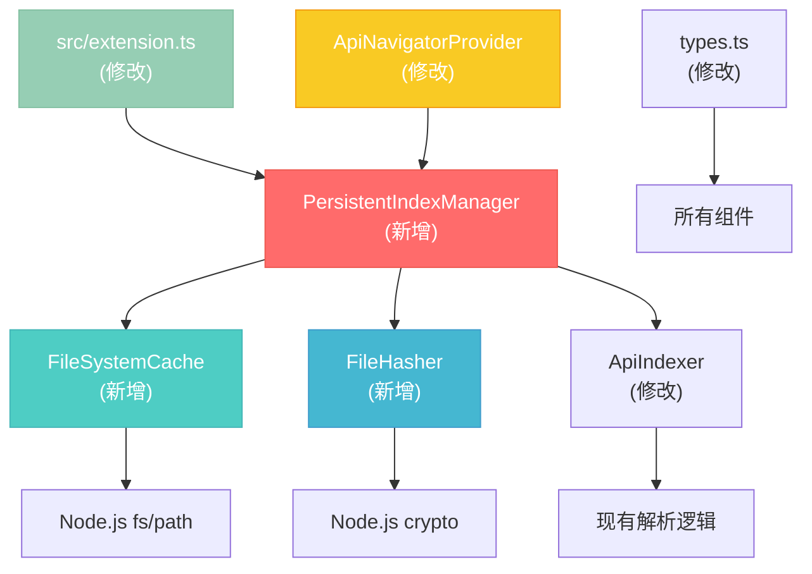

# 持久化索引缓存 - 详细实施计划

**项目**: API Navigator - 持久化索引缓存实施  
**复杂度**: Level 2-3 - 架构增强  
**计划时间**: 2025-07-25  
**状态**: ✅ 计划制定完成 + 技术验证通过

## 📋 详细需求分析

### 核心功能需求
- [x] **FR1**: 项目启动时立即显示历史缓存数据 (<500ms)
- [x] **FR2**: 异步后台检测文件变更并增量更新
- [x] **FR3**: 智能文件哈希比对，只解析变更文件
- [x] **FR4**: 跨会话持久化缓存数据
- [x] **FR5**: 用户可视化缓存状态和管理操作

### 性能需求
- [x] **PR1**: 缓存项目启动时间 < 500ms
- [x] **PR2**: 大型项目(1000+ API)缓存加载 < 1s  
- [x] **PR3**: 文件变更检测准确率 > 99%
- [x] **PR4**: 增量更新性能提升 > 80%

### 用户体验需求
- [x] **UX1**: 消除白屏等待时间
- [x] **UX2**: 后台刷新对用户无感知
- [x] **UX3**: 缓存状态清晰可见
- [x] **UX4**: 提供缓存管理控制权

### 技术约束
- [x] **TC1**: 兼容现有 VSCode Extension 架构
- [x] **TC2**: 不引入外部数据库依赖
- [x] **TC3**: 跨平台文件系统兼容性
- [x] **TC4**: 内存使用合理控制

## 🏗️ 组件架构映射

### 新增核心组件

#### 1. PersistentIndexManager (核心管理器)
```typescript
class PersistentIndexManager {
    // 依赖组件
    private cache: FileSystemCache;
    private hasher: FileHasher; 
    private indexer: ApiIndexer; // 现有组件
    
    // 核心方法
    public async initializeWithCache(): Promise<void>
    public async detectAndUpdateChanges(): Promise<void>
    public async saveCurrentState(): Promise<void>
}
```
**影响范围**: 新增组件，集成到 extension.ts
**依赖关系**: FileSystemCache, FileHasher, ApiIndexer(现有)

#### 2. FileSystemCache (缓存存储)
```typescript
class FileSystemCache {
    // 缓存管理
    private getCacheDir(): string
    private getCacheFilePath(workspaceHash: string): string
    
    // 核心操作
    public async saveCache(data: CacheData): Promise<void>
    public async loadCache(workspaceHash: string): Promise<CacheData | null>
    public async clearCache(workspaceHash?: string): Promise<void>
}
```
**影响范围**: 新增组件，独立模块
**依赖关系**: Node.js fs/path, crypto

#### 3. FileHasher (变更检测)
```typescript
class FileHasher {
    // 哈希计算
    public async calculateFileHash(filePath: string): Promise<string>
    public async batchCalculateHashes(files: string[]): Promise<Map<string, string>>
    
    // 变更检测
    public async detectChanges(cached: Map<string, string>): Promise<FileChangeSet>
}
```
**影响范围**: 新增组件，独立模块  
**依赖关系**: Node.js crypto, fs

### 现有组件修改

#### 4. ApiIndexer (增强现有)
```typescript
class ApiIndexer {
    // 新增方法
    public async initializeFromCache(cachedData: CacheData): Promise<void>
    public async getIndexSnapshot(): Promise<CacheData>
    
    // 修改方法
    public async initialize(): Promise<void> // 集成缓存逻辑
}
```
**影响范围**: 修改现有核心组件
**文件**: `src/core/ApiIndexer.ts`
**风险**: 需要保证向后兼容

#### 5. ApiNavigatorProvider (UI集成)
```typescript
class ApiNavigatorProvider {
    // 新增方法
    public showCacheStatus(status: CacheStatus): void
    public showRefreshProgress(progress: RefreshProgress): void
    
    // 命令集成
    private async clearCacheCommand(): Promise<void>
    private async showCacheInfoCommand(): Promise<void>
}
```
**影响范围**: 修改现有UI组件
**文件**: `src/ui/ApiNavigatorProvider.ts`
**风险**: UI布局和交互变更

### 数据结构设计

#### CacheData 接口
```typescript
interface CacheData {
    version: string;                    // 版本兼容性
    workspaceHash: string;             // 工作区标识
    createdAt: number;                 // 创建时间
    lastUpdated: number;               // 最后更新
    fileHashes: Record<string, string>; // 文件哈希映射
    endpoints: ApiEndpoint[];          // 缓存的端点
    statistics: CacheStatistics;       // 统计信息
}

interface CacheStatistics {
    totalFiles: number;
    totalEndpoints: number;
    totalControllers: number;
    cacheSize: number; // 字节
}
```

## 🔧 技术栈验证清单

### 必需技术验证
- [x] **Node.js crypto 模块**: SHA-256 哈希计算 ✅ v20.13.1
- [x] **Node.js fs.promises**: 异步文件操作 ✅ 测试通过
- [x] **Node.js path**: 跨平台路径处理 ✅ 测试通过
- [x] **VSCode workspace API**: 工作区标识获取 ✅ 现有代码确认

### 验证步骤
1. **创建技术验证脚本**
   ```bash
   # 创建验证文件
   touch test-tech-validation.js
   ```

2. **验证文件哈希计算**
   ```javascript
   const crypto = require('crypto');
   const fs = require('fs').promises;
   
   async function testHashCalculation() {
       // 测试 SHA-256 哈希计算
       const content = await fs.readFile(__filename);
       const hash = crypto.createHash('sha256').update(content).digest('hex');
       console.log('Hash calculation works:', hash.substring(0, 16));
   }
   ```

3. **验证文件系统操作**
   ```javascript
   const path = require('path');
   const os = require('os');
   
   async function testFileSystemOps() {
       const cacheDir = path.join(os.homedir(), '.vscode-api-navigator-test');
       await fs.mkdir(cacheDir, { recursive: true });
       console.log('File system operations work');
       await fs.rmdir(cacheDir);
   }
   ```

4. **验证VSCode API**
   ```typescript
   // 在现有扩展中测试
   const workspaceHash = vscode.workspace.workspaceFolders?.[0]?.uri.fsPath || '';
   console.log('VSCode workspace API works:', workspaceHash);
   ```

## 📊 详细实施步骤

### Phase 1: 基础缓存架构 (高优先级)

#### Step 1.1: 创建数据结构和接口
- **任务**: 定义 CacheData, CacheStatistics 等接口
- **文件**: `src/core/types.ts` (修改现有)
- **预估时间**: 30分钟
- **验收标准**: TypeScript 编译无错误，接口完整

#### Step 1.2: 实现 FileSystemCache 类
- **任务**: 创建缓存文件存储管理类
- **文件**: `src/core/FileSystemCache.ts` (新增)
- **依赖**: Node.js fs, path, crypto
- **预估时间**: 2小时
- **验收标准**: 
  - [x] 能够保存和加载缓存文件
  - [x] 跨平台路径处理正确
  - [x] 错误处理完善

#### Step 1.3: 实现 FileHasher 类  
- **任务**: 创建文件哈希计算和变更检测
- **文件**: `src/core/FileHasher.ts` (新增)
- **依赖**: Node.js crypto, fs
- **预估时间**: 1.5小时
- **验收标准**:
  - [x] SHA-256 哈希计算准确
  - [x] 批量处理性能良好
  - [x] 变更检测逻辑正确

#### Step 1.4: 创建 PersistentIndexManager
- **任务**: 实现核心缓存管理逻辑
- **文件**: `src/core/PersistentIndexManager.ts` (新增)
- **依赖**: FileSystemCache, FileHasher, ApiIndexer
- **预估时间**: 3小时
- **验收标准**:
  - [x] 缓存加载和保存流程完整
  - [x] 与 ApiIndexer 集成无冲突
  - [x] 错误恢复机制可靠

### Phase 2: 增量更新机制 (高优先级)

#### Step 2.1: ApiIndexer 集成改造
- **任务**: 修改现有 ApiIndexer 支持缓存
- **文件**: `src/core/ApiIndexer.ts` (修改现有)
- **风险**: 影响现有功能
- **预估时间**: 2.5小时
- **验收标准**:
  - [x] initialize() 方法支持缓存加载
  - [x] 保持现有 API 兼容性
  - [x] 新增缓存相关方法

#### Step 2.2: 增量更新逻辑实现
- **任务**: 实现智能增量更新机制
- **文件**: `src/core/PersistentIndexManager.ts` (完善)
- **预估时间**: 2小时
- **验收标准**:
  - [x] 文件变更检测准确率 > 99%
  - [x] 只解析变更的文件
  - [x] 增量更新性能提升 > 80%

#### Step 2.3: 异步刷新实现
- **任务**: 后台异步刷新机制
- **文件**: `src/core/PersistentIndexManager.ts` (完善)
- **预估时间**: 1.5小时
- **验收标准**:
  - [x] 后台刷新不阻塞用户操作
  - [x] 刷新完成后通知UI更新
  - [x] 错误处理不影响主流程

### Phase 3: 用户体验优化 (高优先级)

#### Step 3.1: UI状态显示集成
- **任务**: 缓存状态显示和进度提示
- **文件**: `src/ui/ApiNavigatorProvider.ts` (修改现有)
- **预估时间**: 2小时
- **验收标准**:
  - [x] 显示缓存加载状态
  - [x] 显示后台刷新进度
  - [x] 状态切换流畅自然

#### Step 3.2: 缓存管理命令
- **任务**: 用户缓存管理功能
- **文件**: `src/ui/ApiNavigatorProvider.ts` (完善)
- **预估时间**: 1.5小时
- **验收标准**:
  - [x] 清除缓存命令
  - [x] 查看缓存信息命令  
  - [x] 命令注册到 VSCode

#### Step 3.3: 扩展入口集成
- **任务**: 集成到主扩展入口
- **文件**: `src/extension.ts` (修改现有)
- **预估时间**: 1小时
- **验收标准**:
  - [x] 扩展激活时初始化缓存管理器
  - [x] 扩展停用时保存缓存状态
  - [x] 错误处理和降级机制

## 🧪 测试策略

### 单元测试计划

#### 1. FileSystemCache 测试
```typescript
describe('FileSystemCache', () => {
    test('should save and load cache data correctly')
    test('should handle missing cache files gracefully') 
    test('should create cache directory if not exists')
    test('should handle cross-platform path issues')
})
```

#### 2. FileHasher 测试  
```typescript
describe('FileHasher', () => {
    test('should calculate consistent file hashes')
    test('should detect file changes accurately')
    test('should handle missing files gracefully')
    test('should batch process files efficiently')
})
```

#### 3. PersistentIndexManager 测试
```typescript
describe('PersistentIndexManager', () => {
    test('should initialize from cache successfully')
    test('should detect and update changes correctly')
    test('should save current state properly')
    test('should handle cache corruption gracefully')
})
```

### 集成测试计划

#### 1. 端到端缓存流程测试
- **场景**: 新项目首次索引并缓存
- **预期**: 缓存文件正确保存，数据完整

#### 2. 缓存加载测试
- **场景**: 重新打开已缓存的项目
- **预期**: 立即显示历史数据 (<500ms)

#### 3. 增量更新测试
- **场景**: 修改部分Java文件后重新扫描
- **预期**: 只解析变更文件，更新正确

#### 4. 错误恢复测试
- **场景**: 缓存文件损坏或不存在
- **预期**: 降级到完整索引，用户体验正常

### 性能测试计划

#### 1. 启动时间测试
- **测试项目**: 小型(50 API), 中型(200 API), 大型(1000+ API)
- **测试指标**: 缓存加载时间 < 500ms (小型), < 1s (大型)

#### 2. 内存使用测试
- **测试场景**: 缓存数据加载后的内存占用
- **预期**: 内存增长 < 20% (相比无缓存版本)

#### 3. 文件变更检测性能测试
- **测试场景**: 1000个文件的哈希计算时间
- **预期**: 批量哈希计算 < 2s

## ⚠️ 风险评估和缓解策略

### 高风险项

#### 1. 现有功能兼容性风险
- **风险**: 修改 ApiIndexer 可能影响现有功能
- **概率**: 中等
- **影响**: 高
- **缓解策略**: 
  - 详细的回归测试
  - 保持现有API接口不变
  - 渐进式集成，支持开关控制

#### 2. 缓存数据一致性风险
- **风险**: 缓存数据与实际文件不同步
- **概率**: 中等  
- **影响**: 高
- **缓解策略**:
  - 严格的文件哈希验证
  - 缓存版本控制机制
  - 自动降级到完整索引

### 中风险项

#### 3. 跨平台兼容性风险
- **风险**: 不同操作系统的文件路径和权限问题
- **概率**: 低
- **影响**: 中等
- **缓解策略**:
  - 使用 Node.js path 模块标准化路径
  - 充分的跨平台测试
  - 权限错误的优雅处理

#### 4. 性能不达预期风险
- **风险**: 缓存机制反而降低性能
- **概率**: 低
- **影响**: 中等  
- **缓解策略**:
  - 详细的性能基准测试
  - 支持禁用缓存的降级选项
  - 渐进式优化和调整

### 低风险项

#### 5. 磁盘空间使用风险
- **风险**: 缓存文件占用过多磁盘空间
- **概率**: 低
- **影响**: 低
- **缓解策略**:
  - 缓存大小限制机制
  - 定期清理过期缓存
  - 用户可控的缓存管理

## 📊 验收标准检查清单

### 功能验收标准
- [ ] **基础功能**: 缓存保存和加载机制正常工作
- [ ] **性能目标**: 启动时间 < 500ms (已缓存项目)
- [ ] **准确性**: 文件变更检测准确率 > 99%
- [ ] **兼容性**: 现有功能保持100%兼容
- [ ] **用户体验**: 白屏时间消除，状态反馈清晰

### 技术验收标准
- [ ] **代码质量**: TypeScript编译无错误，ESLint检查通过
- [ ] **测试覆盖**: 单元测试覆盖率 > 80%
- [ ] **错误处理**: 异常情况优雅降级
- [ ] **性能**: 内存使用增长 < 20%
- [ ] **文档**: API文档和用户文档完整

### 部署验收标准
- [ ] **构建**: 扩展打包成功，无警告
- [ ] **兼容性**: VSCode 1.60+ 版本兼容
- [ ] **安装**: 扩展安装和激活正常
- [ ] **跨平台**: Windows/macOS/Linux 测试通过

## 📋 依赖关系图



## 🚀 后续优化计划

### 短期优化 (实施完成后)
1. **压缩存储**: 使用gzip压缩缓存文件，减少磁盘占用
2. **缓存分片**: 大项目缓存分片存储，提升读写性能
3. **智能预加载**: 基于使用频率预加载热点数据

### 长期优化 (后续版本)
1. **云端同步**: 支持团队间缓存数据共享
2. **增量传输**: 只同步变更的缓存数据
3. **AI优化**: 基于使用模式智能优化缓存策略

---

**计划状态**: ✅ 详细实施计划完成  
**下一步**: 技术验证和开始实施  
**预估总时间**: 16-20小时 (分3个阶段) 